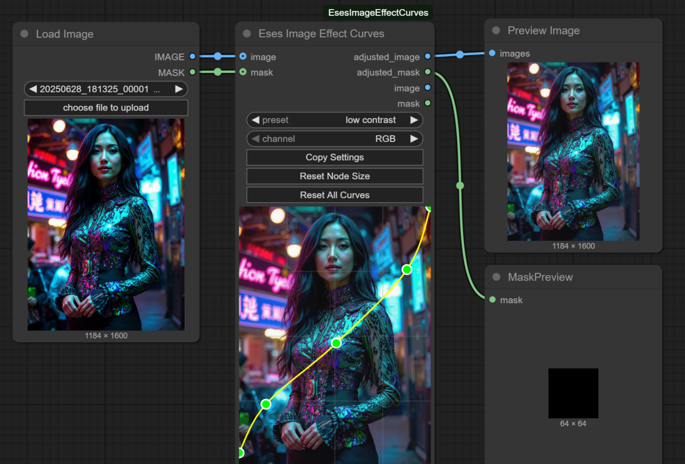

# Eses Image Effect Curves




> [!CAUTION]
> Before downloading and using the contents of this repository, please review the LICENSE.txt and the disclaimer.
> I kindly ask that you respect the licensing terms and the effort put into these tools to ensure their 
> continued availability for everyone. Thank you!


## Description

The 'Eses Image Effect Curves' is a ComfyUI custom node that provides a real-time curves adjustment tool directly within the user interface. It allows for interactive control over the tonal range of both images and masks, using a GPU-accelerated PyTorch backend for near instant feedback.

This node is a single tool for tonal adjustments without need to chain multiple nodes together. All curve settings are saved with your workflow and are restored when you reload the page, ensuring a seamless and non-destructive workflow.

💡 If you have ComfyUI installed, you don't need any extra dependencies.

 * 💡 Simple save presets feature:
    * Press node `Copy Settings` button, and then create a `"your preset name.json"` file in custom node's `/presets` folder
    * Paste the curves data inside `"your preset name.json"` file. 
    * Next time you reload ComfyUI or reload ComfyUI's webpage, new `"your preset name.json"` preset can be found from the `Preset` -dropdown.


## Features

* **Interactive Curve Editor**:
    * A live preview of the curve is displayed directly on the node, updated in real-time as you drag points.
    * Add and remove editable points for detailed curve shaping.
    * Supports moving all points, including endpoints, on both the X and Y axes for effects like level inversion and crushing blacks/whites.
    * Visual "clamping" lines show when endpoints are moved from the edges, providing clear feedback on the adjustment range.

* **Multi-Channel Adjustments**:
    * Apply curves to the combined RGB channels for overall tonal control.
    * Isolate adjustments to individual Red, Green, or Blue channels for precise color grading.
    * Apply a separate, dedicated curve directly to an input mask, or to saturation and luma curve.

* **State Serialization**:
    * All curve adjustments for all channels are saved with your workflow.
    * The node's state, including manually resized dimensions, persists even after refreshing the browser page.

* **Quality of Life Features**:
    * Automatic resizing of the node to best fit the aspect ratio of the input image.
    * "Reset Curve" button to instantly revert the currently selected channel's curve to a linear state.
    * "Reset Node Size" button to re-trigger the auto-sizing logic.


## Requirements

* PyTorch – (you should have this if you have ComfyUI installed).


## Installation

1.  **Navigate to your ComfyUI custom nodes directory:**
    ```
    ComfyUI/custom_nodes/
    ```
2.  **Clone this repository:**
    ```
    git clone https://github.com/quasiblob/ComfyUI-EsesImageEffectCurves.git
    ```
3.  **Restart ComfyUI:**
    * After restarting, the "Eses Image Effect Curves" node will be available in the "Eses Nodes/Image Adjustments" category.


## Folder Structure

```
ComfyUI-EsesImageEffectCurves/
├── __init__.py                  # Main module defining the custom nodes.
├── image_effect_curves.py       # The Python file containing the node logic.
├── js/                          # Folder for JavaScript files.
│   └── image_effect_curves.js   # Frontend logic for the interactive node.
├── README.md                    # This file.
└── requirements.txt             # Python package dependencies.
```


## Usage

* Connect an `image` and/or a `mask` tensor to the corresponding inputs.
* Select the `channel` you wish to adjust from the dropdown menu inside the node.
* Click and drag the points on the curve in the preview area to modify the image or mask tones.
* The node outputs both the original and the adjusted image/mask for flexible workflow routing.


## Inputs

* **image** (`IMAGE`, *optional*): The input image to be adjusted.
* **mask** (`MASK`, *optional*): The input mask to be adjusted.


## Outputs

* **image** (`IMAGE`): A passthrough of the original input image.
* **mask** (`MASK`): A passthrough of the original input mask.
* **adjusted_image** (`IMAGE`): The image after the curve adjustments have been applied.
* **adjusted_mask** (`MASK`): The mask after the curve adjustments have been applied.


## Category

Eses Nodes/Image Adjustment


## Contributing

- Feel free to report bugs and improvement ideas in issues, but I may not have time to do anything.


## License

- See LICENSE.txt


## About

-


## Version History

**2025.7.7 Version 1.0.4** Cleanup code formatting

**2025.7.2 Version 1.0.3** Cleanup comments and description

**2025.6.29 Version 1.0.2** Fixed deserialization related field duplication issue

**2025.6.28 Version 1.0.1** Fixed collapsed node related visual issue

**2025.6.28 Version 1.0.0** Released


## ⚠️Disclaimer⚠️

This custom node for ComfyUI is provided "as is," without warranty of any kind, express or implied. By using this node, you agree that you are solely responsible for any outcomes or issues that may arise. Use at your own risk.


## Acknowledgements

Thanks to the ComfyUI team and community for their ongoing work!